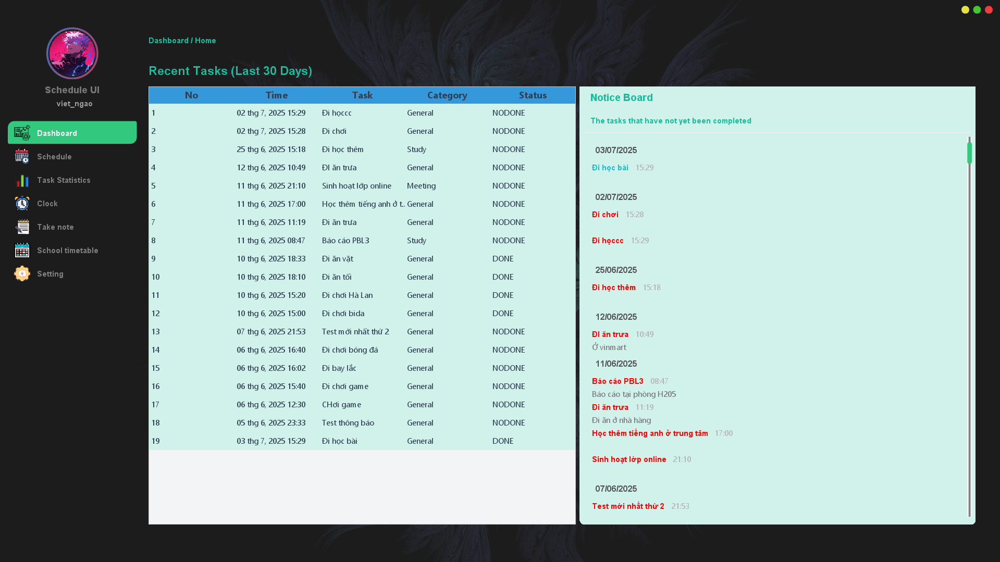
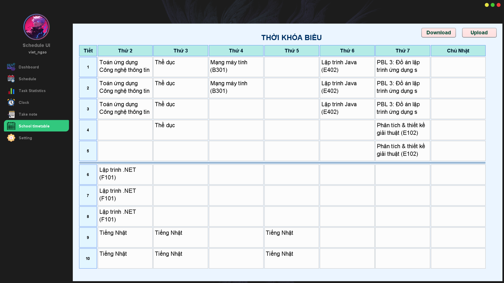
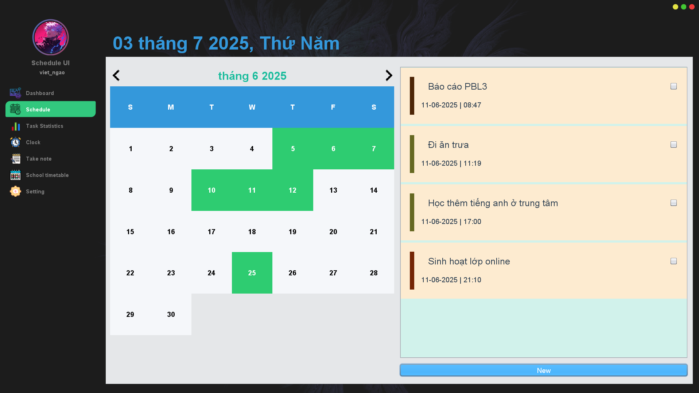
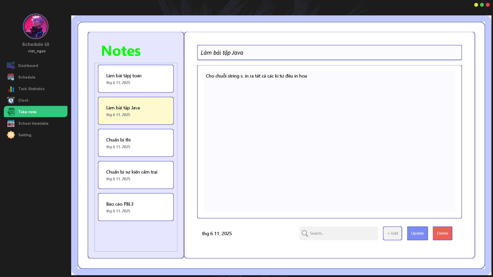
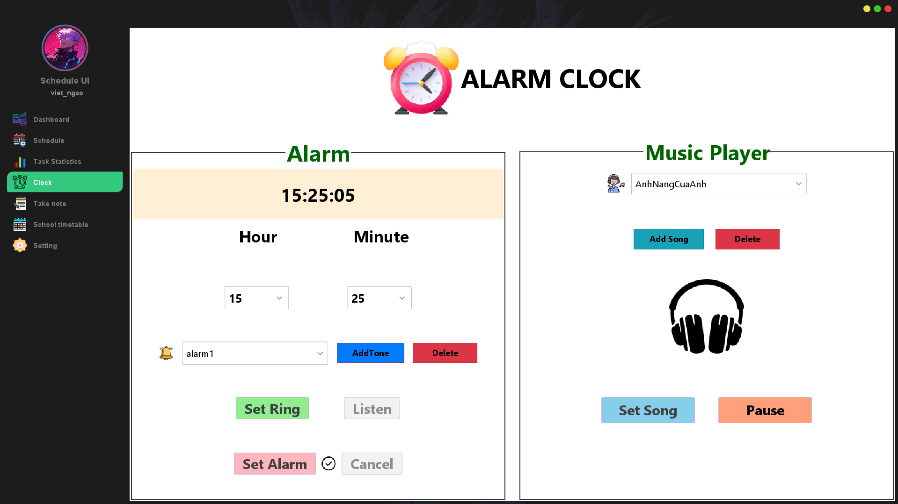
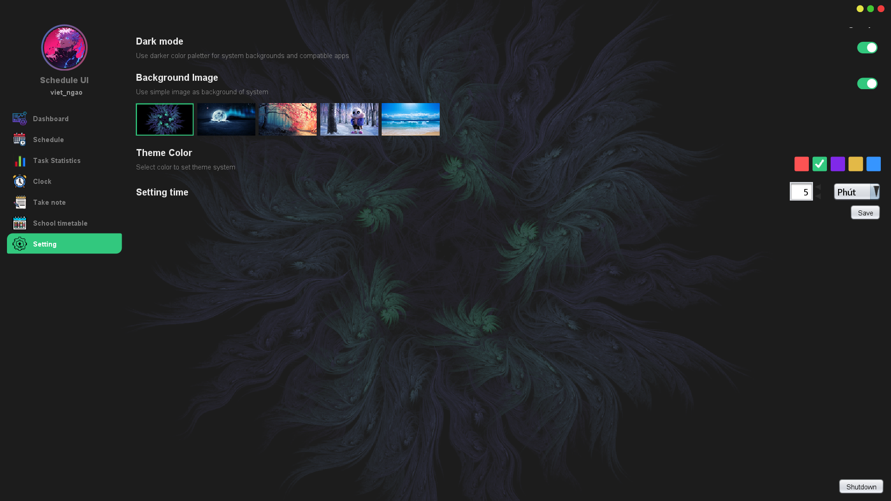

# PBL3 - Schedule, Notes & Alarm Management Application

## Introduction

PBL3 is a Java Swing application designed to help students and professionals automate and manage their daily schedules, personal notes, and reminders. It streamlines the process of converting timetable screenshots into an editable calendar, taking quick notes, and setting intelligent alarms.

## System Overview

The application follows a modular architecture with clear separation of concerns:

```
[ User ]
   ↓
[ UI Layer (Swing Forms) ]
   ↓
[ Service Layer ]
   ↓
[ DAO Layer ]
   ↓
[ MySQL Database ]
```

-   **UI Layer**: Interactive Swing forms for login, calendar, notes, and alarms.
-   **Service Layer**: Implements business logic, input validation, scheduling, and email notifications.
-   **DAO Layer**: Handles CRUD operations via JDBC using DBHelper.
-   **Utilities**: PasswordUtils for secure hashing, background loaders for performance.
-   **Database**: MySQL storing users, events, notes, tracks, and settings.

## Key Features

### Dashboard

Comprehensive dashboard displaying recent task activities over the last 30 days. Features a detailed task table showing completion status, categories, and timestamps, alongside a notice board highlighting pending and overdue tasks for efficient task management.



### Timetable Extraction

Capture timetable directly from student portal screenshots and convert it into a clear, editable calendar.



### Calendar Management

View schedules by month/week/day, add/edit/delete events with intuitive, color-coded badges and hover tooltips.



### Personal Notes

Create, auto-save, and search notes seamlessly in the background without interrupting workflow.



### Smart Alarms And Flexible Music

Set custom alarm times to stay on top of your work schedule, with flexible music playback options to keep users motivated and engaged throughout their day.



### Listen Music

Integrated music player functionality that allows users to enjoy their favorite tracks while working, providing a personalized and flexible user experience.

### Task Statistics

Comprehensive task analytics featuring completion rates, overdue tasks, and pending tasks visualization. Users can track their productivity with detailed charts showing monthly progress and performance metrics.


### Settings

Comprehensive settings panel allowing users to customize their experience with dark/light mode toggle, theme selection with multiple background options, and configurable email notification timing for task reminders sent via Gmail.



## UI/UX Highlights

-   Modern, minimalist design with Light/Dark theme toggle.
-   Responsive custom components (buttons, panels, badges) for consistent look-and-feel.
-   Hover tooltips and quick-access controls for efficient interaction.

## Extended Features (IT Practice)

-   **Music Player**: Play MP3/WAV using JLayer and javax.sound.sampled.
-   **Theme Customization**: FlatLaf support for dynamic background and color schemes.
-   **Daily Email Summary**: Automatic schedule digest sent via JavaMail API every morning.

## Technology & Libraries

-   **Language**: Java 8+
-   **UI**: Java Swing, FlatLaf
-   **Database**: MySQL (JDBC)
-   **OCR**: Tesseract
-   **Audio**: JLayer, javax.sound.sampled
-   **Email**: JavaMail API
-   **Testing**: JUnit5
-   **Profiling**: VisualVM

## Project Structure

```
PBL3/                     # Project root
├─ nbproject/              # NetBeans project files
├─ src/
│  ├─ com/pbl/
│  │  ├─ background/       # Background images
│  │  ├─ chart/            # Chart rendering components
│  │  │  └─ blankchart/     # Blank chart templates
│  │  ├─ component/        # Custom Swing components
│  │  ├─ dao/              # Data Access Objects
│  │  ├─ event/            # Event models and processing
│  │  ├─ form/             # Main Swing forms
│  │  ├─ icon/             # Icons and resources
│  │  ├─ main/             # Application entry point
│  │  ├─ menu/             # Menu bar and navigation
│  │  ├─ model/            # Domain models (User, Task, Note, Track)
│  │  ├─ music/            # Music player logic
│  │  ├─ properties/       # Configuration and constants
│  │  ├─ service/          # Business logic services
│  │  ├─ swing/            # Swing utilities and base classes
│  │  │  ├─ noticeboard/     # Noticeboard UI
│  │  │  ├─ progress/        # Progress bar UI
│  │  │  ├─ scrollbar/       # Custom scrollbars
│  │  │  └─ win_button/      # Custom window buttons
│  │  ├─ theme/            # Theme and color management
│  │  ├─ track/            # Audio track management
│  │  └─ utility/          # DBHelper, PasswordUtils, parsers
├─ libs/                   # External JAR dependencies (e.g., timingframework)
├─ screenshots/            # UI screenshots for README
├─ docs/                   # Diagrams and additional documentation
├─ build/                  # Compiled classes and resources
├─ .gitignore              # Git ignore rules
├─ README.md               # Project overview (this file)
└─ LICENSE                 # MIT License
```

## Requirements

-   Java 8 or higher
-   MySQL Server
-   NetBeans or any IDE with Swing support

## Installation & Run

1. **Import Project**: In NetBeans, go to File → Open Project and select the project root.
2. **Add Libraries**: Ensure `libs/timingframework-1.0.jar` is added in project settings.
3. **Configure Database**: Create a MySQL database and update credentials in `src/com/pbl/utility/DBHelper.java`.
4. **Build & Run**: Clean and Build the project, then run the main class in `com.pbl.main`.

## Contributing

Contributions, bug reports, and feature requests are welcome. Please open an issue or submit a pull request.

## License

This project is licensed under the MIT License. See LICENSE for details.
